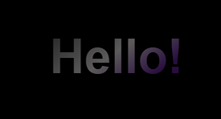
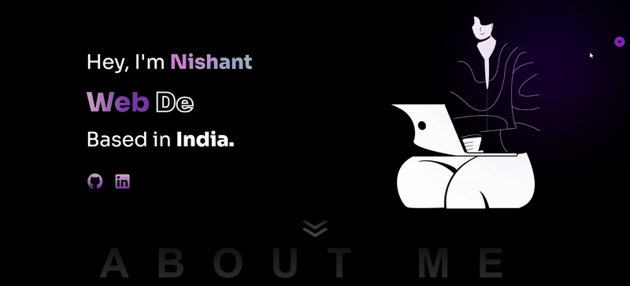

# 🎨 My Portfolio Website

Welcome to **my personal portfolio** — a place where I showcase my skills, projects, experience, and how to get in touch! Built with React and sprinkled with cool animations and interactivity. 🚀✨

---

## 📸 Preview





---

## 🚀 Features

- 📱 **Responsive Design** — Looks great on any device (mobile, tablet, desktop)
- 🎯 **Smooth Scrolling** — Navigate effortlessly with `react-scroll`
- 🎨 **Animated Sidebar** — Fun sidebar with icons and tooltips (`framer-motion` + `react-tooltip`)
- 🎵 **Background Music** — Toggle some chill tunes while browsing 🎶
- 🧩 Sections: Home, About, Skills, Experience, Projects, Certificates, Contact

---

## 🛠️ Technologies Used

- ⚛️ React.js
- 💫 Framer Motion (Animations)
- 🔄 React Scroll (Smooth scrolling)
- 💡 React Tooltip (Helpful tooltips)
- 🎨 React Icons (Beautiful icons)
- 🎧 Audio API (Background music player)

---

## 🏁 Getting Started

### Prerequisites

Make sure you have these installed:

- 🔥 Node.js
- 📦 npm

### Installation

1. Clone the repo:

   ```bash
   git clone https://github.com/yourusername/portfolio-website.git
   cd portfolio-website


